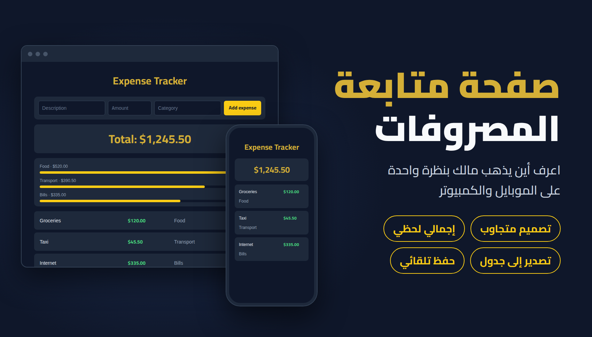
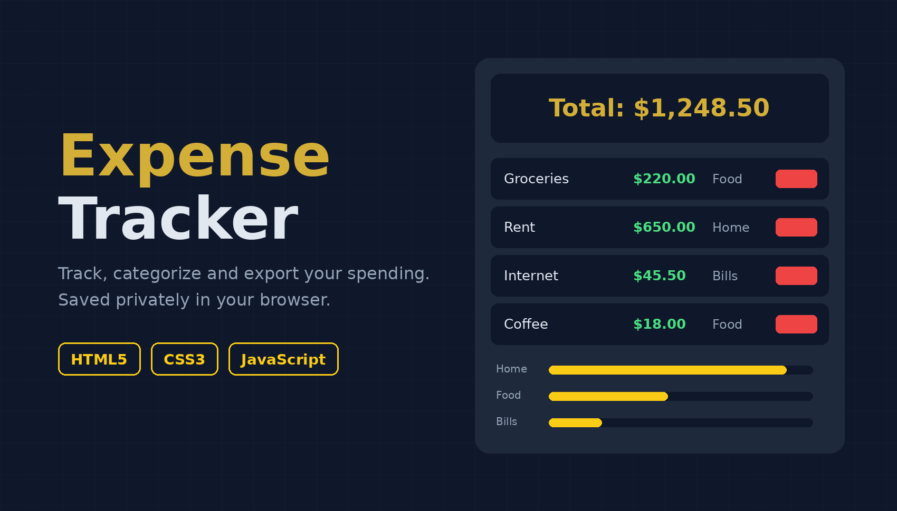
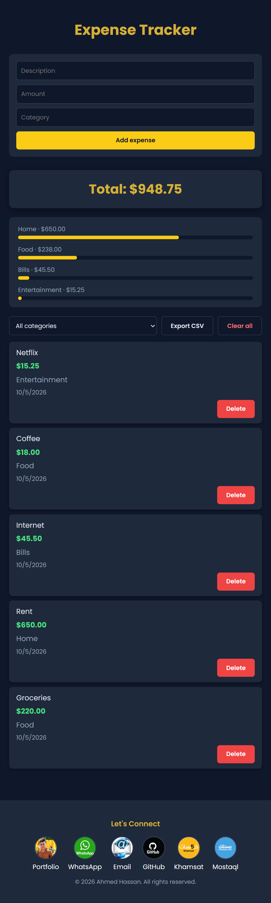

# 💰 Expense Tracker

A clean, responsive expense tracker that helps you record your spending, see your running total at a glance, and understand where your money goes. Built with vanilla HTML, CSS, and JavaScript, with no frameworks or libraries.

🔗 **[Live Demo](https://AhmedHassanHamed.github.io/expense-tracker)**

## ✨ Features

- Add expenses with a description, amount, and category
- Category suggestions based on the categories you already used
- Automatic date stamping for every expense, newest first
- Live running total, formatted to two decimals
- Filter expenses by category, with the total updating to match
- Spending breakdown by category with simple progress bars
- Export all expenses to a CSV file (opens correctly in Excel)
- Delete a single expense or clear everything, each with a confirmation prompt
- Input validation (no empty descriptions or invalid amounts)
- Data persists in the browser using `localStorage`, with safe handling of corrupted data
- Fully responsive: works on phones, tablets, and desktops
- Long text wraps gracefully without breaking the layout
- Accessibility: ARIA labels, live-updating total, visible keyboard focus, and reduced-motion support

## 🛠️ Built With

- **HTML5**: semantic structure (`<main>`, `<footer>`), form validation, `<datalist>`
- **CSS3**: Flexbox, Grid, media queries, custom styling
- **JavaScript (ES6)**: DOM manipulation, `localStorage`, event handling, Blob API for CSV export

## 📸 Screenshots

### Desktop




### Mobile



## 🚀 Getting Started

1. Clone the repository:
   ```bash
   git clone https://github.com/AhmedHassanHamed/expense-tracker.git
   ```
2. Open the project folder.
3. Open `index.html` in your browser. No installation or build step is needed.

## 📂 Project Structure

```
expense-tracker/
├── imgs/
├── Project_Screen_Shots/
├── index.html
├── style.css
├── script.js
└── README.md
```

## 🧠 What I Learned

- Manipulating the DOM with JavaScript
- Storing and retrieving data with `localStorage`, and handling invalid stored data safely
- Using unique IDs instead of array indexes so items are deleted correctly even when the list is filtered
- Building responsive layouts with Flexbox, Grid, and media queries
- Validating user input
- Generating and downloading files in the browser (CSV export)
- Improving accessibility with ARIA attributes and keyboard focus styles
- Publishing a project with Git and GitHub Pages

## 🔮 Future Improvements

- Edit existing expenses
- Monthly budget with spending alerts
- Filter by date range
- Light/dark theme toggle
- Pie or bar charts for deeper insights

## 👤 Author

**Ahmed Hassan**

- GitHub: [@AhmedHassanHamed](https://github.com/AhmedHassanHamed)
- Portfolio: [ahmedhassanhamed.github.io/AhmedHassanHamed](https://ahmedhassanhamed.github.io/AhmedHassanHamed/)
