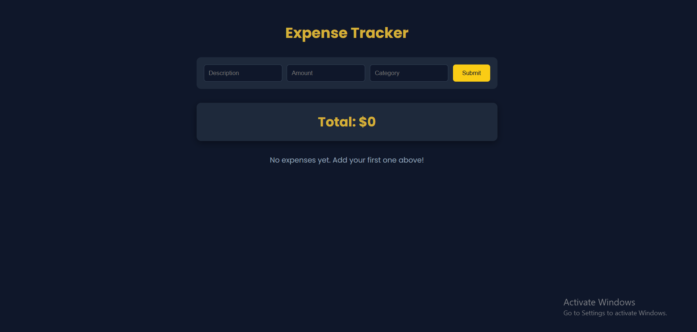
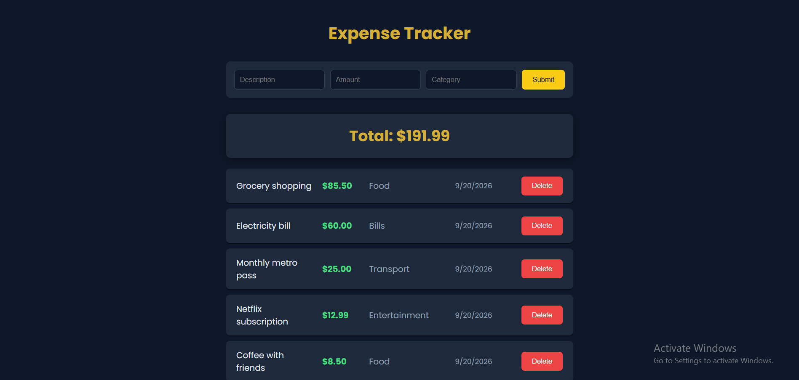
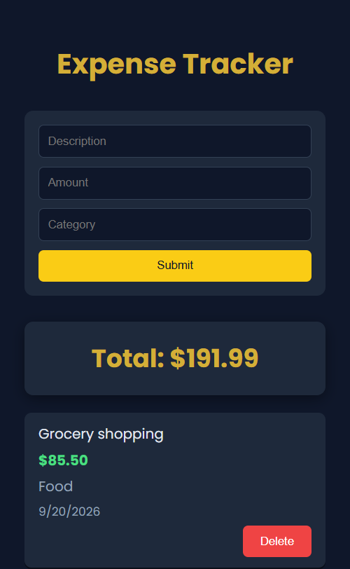
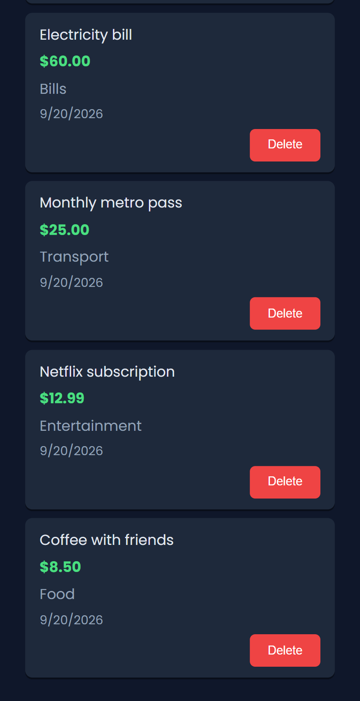

# 💰 Expense Tracker

A clean, responsive expense tracker that helps you record your spending and see your running total at a glance. Built with vanilla HTML, CSS, and JavaScript, with no frameworks or libraries.

🔗 **[Live Demo](https://AhmedHassanHamed.github.io/expense-tracker)**

## ✨ Features

- Add expenses with a description, amount, and category
- Automatic date stamping for every expense
- Live running total, formatted to two decimals
- Delete expenses with a confirmation prompt
- Input validation (no empty descriptions or invalid amounts)
- Data persists in the browser using `localStorage`
- Fully responsive: works on phones, tablets, and desktops
- Long text wraps gracefully without breaking the layout

## 🛠️ Built With

- **HTML5**: semantic structure and form validation
- **CSS3**: Flexbox, media queries, custom styling
- **JavaScript (ES6)**: DOM manipulation, `localStorage`, event handling

## 📸 Screenshots

### Desktop





### Mobile




## 🚀 Getting Started

1. Clone the repository:
   ```bash
   git clone https://github.com/AhmedHassanHamed/expense-tracker.git
   ```
2. Open the project folder.
3. Open `index.html` in your browser. No installation or build step is needed.

## 📂 Project Structure

```
expense-tracker/
├── index.html
├── style.css
├── script.js
└── README.md
```

## 🧠 What I Learned

- Manipulating the DOM with JavaScript
- Storing and retrieving data with `localStorage`
- Building responsive layouts with Flexbox and media queries
- Validating user input
- Publishing a project with Git and GitHub Pages

## 🔮 Future Improvements

- Filter expenses by category
- Category summary and charts
- Edit existing expenses
- Export data to CSV

## 👤 Author

**Ahmed Hassn**

- GitHub: [@AhmedHassanHamed](https://github.com/AhmedHassanHamed)
